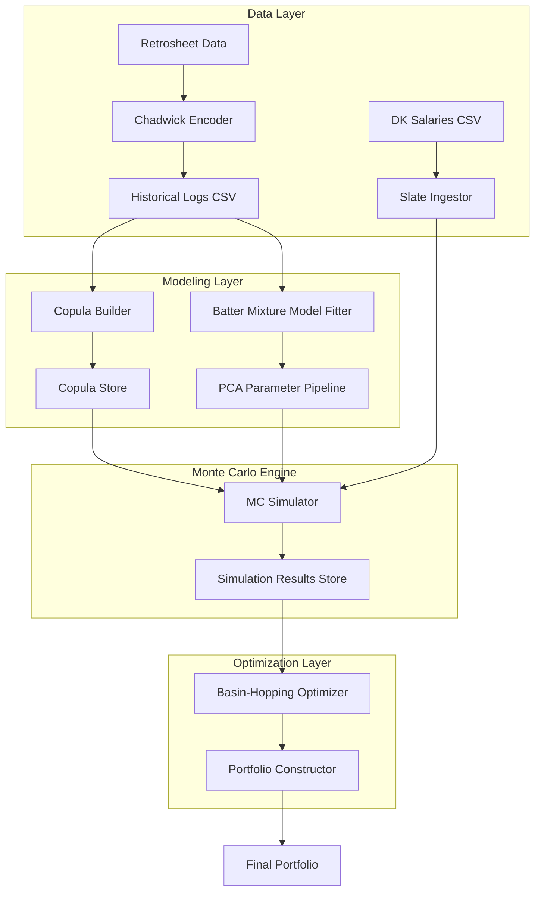

# MLB DFS Portfolio Optimization Architecture Plan

This document outlines the architecture for an MLB Daily Fantasy Sports (DFS) portfolio optimization system targeting DraftKings GPP contests. The system uses Empirical Copula theory for modeling player dependencies and Basin-Hopping for lineup optimization.

## 1. System Overview

The system is designed as a modular numerical pipeline. It transforms raw historical game data and current slate information into an optimized portfolio of lineups.

### 1.1 High-Level Component Diagram

### 1.2 Core Modules
1.  **Data Layer**: Handles ingestion and normalization of Retrosheet and DraftKings data.
2.  **Copula Module**: Builds the empirical dependency structure from historical games.
3.  **Marginal Distribution Module**: Defines the statistical distributions for individual players.
4.  **Simulation Engine**: Performs the Monte Carlo simulations to generate joint outcome realizations.
5.  **Optimizer**: Executes Basin-Hopping to find high-upside lineups.
6.  **Portfolio Manager**: Diversifies selections by "consuming" simulation successes.

---

## 2. Data Layer

### 2.1 Historical Ingestion
*   **Source**: Retrosheet event files.
*   **Process**: Use `chadwick` tools (e.g., `cwevent`, `cwgame`) to generate CSV files containing player performance (hits, HRs, RBIs, etc.) and DraftKings scoring logic.
*   **Storage**: Processed historical logs should be stored in **Parquet** format for fast columnar access during model fitting.

### 2.2 Schema Design
*   **Copula Store**: A matrix of rank-ordered quantiles (0.0 to 1.0) for 10-player groups (9 batters + 1 pitcher).
*   **Model Parameters**:
    *   `PCA_Components`: The 2D plane coefficients from the fitted mixture models.
    *   `Global_Batter_Stats`: Mean/Std used for normalizing parameters.
*   **Slate Data**: Standardized player records containing `Name`, `ID`, `Team`, `Position`, `Salary`, and `Projected_Mean/Std`.

### 2.3 Runtime vs. Precomputed
*   **Precomputed**: Empirical copula (updated seasonally), PCA plane for batter parameters.
*   **Runtime**: Marginal distribution fitting for the specific slate, Monte Carlo simulation, Basin-Hopping optimization.

---

## 3. Empirical Copula Module

### 3.1 Construction
The empirical copula captures the joint distribution of performances within a 10-player group (Team A's batters vs. Team B's pitcher).
*   **Indexing**: Games are indexed by batting order slot (1-9) and the opposing pitcher's performance relative to their own distribution.
*   **Quantile Mapping**: For every historical game, we calculate the performance percentile for each slot and the pitcher.
*   **Storage**: A $G \times 10$ matrix where $G$ is the number of historical games.

### 3.2 Sampling
To simulate a group of 10 players:
1.  Randomly select $n$ rows (with replacement) from the $G \times 10$ matrix.
2.  Each row provides a vector of 10 quantiles $[u_1, u_2, ..., u_{10}]$.
3.  These quantiles are used as inputs to the Inverse CDF (PPF) of each player's marginal distribution.

---

## 4. Player Marginal Distribution Module

### 4.1 Pitcher Model (Gaussian)
*   **Distribution**: $X_p \sim \mathcal{N}(\mu, \sigma)$.
*   **Inputs**: Projected mean and standard deviation.
*   **Implementation**: `scipy.stats.norm.ppf(u)`.

### 4.2 Batter Model (Mixture Distribution)
*   **Continuous Form**: $f(x) = w \cdot \text{Exp}(\lambda) + (1-w) \cdot \mathcal{N}(\mu, \sigma)$.
*   **PCA Pipeline**:
    1.  Fit $\vec{\theta} = (w, \lambda, \mu, \sigma)$ to historical batter data.
    2.  Perform PCA on these 4D vectors to find the primary 2D plane of variance.
    3.  At runtime, given a projected $\mu'$ and $\sigma'$, find the point on the 2D plane that minimizes distance to the inputs, yielding the full 4D parameter set.
*   **Discretization**: Since MLB scores are discrete (points for HR, 1B, etc.), the continuous mixture is mapped back to discrete values.
    *   **Mapping Strategy**: Create a cumulative distribution function (CDF) of historical actual scores. Map the continuous quantile $u$ from the mixture distribution to the discrete score $s$ such that $CDF_{empirical}(s-1) < u \leq CDF_{empirical}(s)$.

### 4.3 Projection Abstraction
To ensure the system is "swappable" for future prop market data:
*   **`ProjectionProvider` Interface**: An abstract base class defining `get_pitcher_projection(player_id)` and `get_batter_projection(player_id)`.
*   **Implementations**:
    *   `StaticCSVProvider`: Reads from the DK Salary CSV or a supplemental projections CSV.
    *   `RandomProvider`: For testing, generates values within realistic bounds.
    *   `PropMarketProvider` (Future): Implementation that scrapes or queries an API.

---

## 5. Monte Carlo Simulation Engine

### 5.2 Storage and Access
*   **In-Memory**: During a single run, the simulation matrix should reside in memory as a `numpy.ndarray` for maximum speed during optimization.
*   **On-Disk Persistence**: For auditing or re-running optimization without re-simulating, store the matrix in **Apache Parquet** format. This allows metadata (player IDs, iteration numbers) to be preserved alongside the scores.
*   **Access Pattern**: The Optimizer reads a subset of columns (player scores) and rows (active iterations). Portfolio construction modifies the "active" row mask after each selection.

---

## 6. Lineup Optimizer (Basin-Hopping)

### 6.1 Objective Function
Maximize $P(\text{Lineup Score} \geq \text{Target})$.
*   Estimated as: `(Lineup_Sim_Matrix.sum(axis=1) >= Target).mean()`.

### 6.2 Optimization Strategy
*   **Local Search**: A greedy hill-climbing step that tries single-player swaps to improve the probability.
*   **Mutation**: Randomly swap 3 players while maintaining position/salary eligibility.
*   **Acceptance**: Metropolis-Hastings criteria (always accept better, accept worse with probability $e^{-\Delta/T}$).
*   **Parallelism**: Run $m=250$ independent chains using `multiprocessing` or `Ray`.

---

## 7. Portfolio Construction Module

### 7.1 Iterative Greedy Selection
1.  Optimize the best possible lineup $L_1$ using the full simulation set $S$.
2.  Identify the specific simulation indices $i \in \{1...n\}$ where $L_1$ achieved the target score.
3.  "Consume" these indices by removing them or zeroing out scores for those iterations in the master simulation matrix.
4.  Optimize $L_2$ using the remaining (un-hit) simulation iterations.
5.  Repeat until the desired portfolio size is reached.

---

## 8. Interfaces and Configuration

*   **CLI/Config**: A YAML configuration file for:
    *   Paths to Retrosheet/DK data.
    *   Parameters: $n$ (sims), $m$ (BH chains), $T$ (temperature), `portfolio_size`.
    *   `target_score`: Optional override.
*   **Logging**: Standard Python `logging` to track optimization progress and convergence of Basin-Hopping chains.

---

## 9. Technology Recommendations

*   **Language**: **Python 3.11+**.
*   **Numerical Stack**: **NumPy** and **SciPy** for core calculations. **Pandas** for data manipulation.
*   **Performance**:
    *   **Numba**: Use `@njit` to speed up the Basin-Hopping objective function if pure NumPy is a bottleneck.
    *   **Ray**: For distributing the $m$ Basin-Hopping chains across multiple CPU cores.
    *   **Parquet/PyArrow**: For efficient storage of simulation results and historical data.

---

## 10. Phased Implementation Roadmap

1.  **Phase 1: Skeleton & Data**: Ingest DK slate and Retrosheet CSVs. Implement basic Gaussian marginals for all players.
2.  **Phase 2: Simulation Engine**: Implement the Empirical Copula sampling and basic Monte Carlo scoring.
3.  **Phase 3: Optimizer**: Implement the Basin-Hopping algorithm with salary/position constraints.
4.  **Phase 4: Batter Modeling**: Implement the Mixture Model fitting and PCA pipeline.
5.  **Phase 5: Portfolio Selection**: Implement the greedy selection loop and "consumption" logic.
6.  **Phase 6: Refinement**: Performance tuning (Numba/Ray) and prop market data integration.
